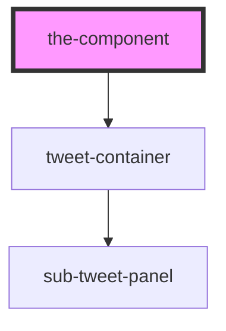

# the-component

<!-- Auto Generated Below -->

## Properties

| Property    | Attribute    | Description | Type                                                                              | Default     |
| ----------- | ------------ | ----------- | --------------------------------------------------------------------------------- | ----------- |
| `opts`      | --           |             | `{ id: number; nomeOpt: string; descOpt: string; subOpts: []; hide: boolean; }[]` | `undefined` |
| `tituloTag` | `titulo-tag` |             | `string`                                                                          | `undefined` |

## Dependencies

### Depends on

- [tweet-container](tweet-container)

### Graph

----------------------------------------------

*Built with [StencilJS](https://stenciljs.com/)*
