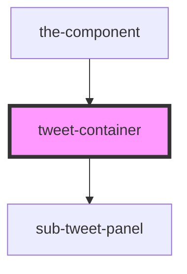

# tweet-container

<!-- Auto Generated Below -->

## Properties

| Property | Attribute | Description | Type                                                                              | Default     |
| -------- | --------- | ----------- | --------------------------------------------------------------------------------- | ----------- |
| `tweets` | --        |             | `{ id: number; nomeOpt: string; descOpt: string; subOpts: []; hide: boolean; }[]` | `undefined` |

## Dependencies

### Used by

 - [the-component](..)

### Depends on

- [sub-tweet-panel](sub-tweet-panel)

### Graph

----------------------------------------------

*Built with [StencilJS](https://stenciljs.com/)*
