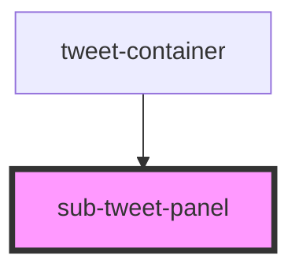

# sub-tweet-panel

<!-- Auto Generated Below -->

## Properties

| Property  | Attribute | Description | Type                                  | Default     |
| --------- | --------- | ----------- | ------------------------------------- | ----------- |
| `subopts` | --        |             | `{ label: string; value: string; }[]` | `undefined` |

## Dependencies

### Used by

 - [tweet-container](..)

### Graph

----------------------------------------------

*Built with [StencilJS](https://stenciljs.com/)*
